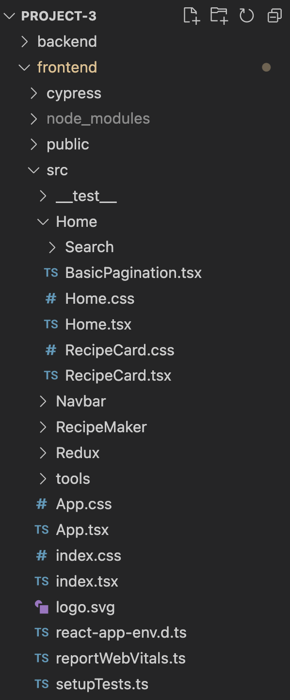
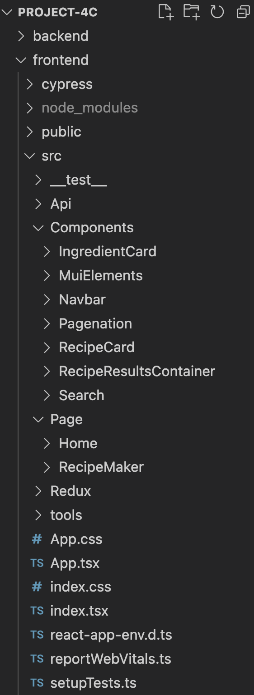

# Dokumentasjon
## Kjøre lokalt eller server
Clone repo og kjør `npm install` i både frontend og backend mappene. Deretter åpner du en ny terminal og kjører `cd frontend` og `npm start`. Hvis du har problemer med importing av @material-ui/core, kjør `npm install @material-ui/core --force`.

Hvis du har lyst å teste backenden, må du kjøre `cd backend` og `node index.js`. Deretter åpner du en ny terminal og kjører `cd frontend` og `npm start`. Til slutt må du også gå i `index.ts` for å kommentere ut linje 12 og "ukommentere" linje 11 for å kunne bruke localhost.

Hvis du ikke vil kjøre lokalt, trykk her http://it2810-30.idi.ntnu.no/project4c. Husk VPN hvis du ikke er på eduroam!

## Oppgave
Vi har valgt oppgave 4c. Vi har basert oppgaven på tilbakemeldingene vi fikk på prosjekt 3 og utbedret disse. Det var mange tilbakemeldinger vi var enige i, mens andre var vi veldig uenige i og dermed har vi ikke gjort noe med det. F.eks. fikk vi kritikk for å ikke ha med bilder på oppskriftene, noe vi synntes ble veldig feil iforhold til prosjekt beskrivelsen når det gjaldt bærekraftig web utvikling. Selvfølgelig kunne vi valgt å legge til bilder av lav oppløsning, men vi følte det var litt i gråsonen.

## Tilbakemeldinger og utbedringer

### Syntes allikevel at dette kunne blitt tatt i bruk i alle komponenter som f.eks i RecipeMaker der de bruker standard divs isteden for materialUI sine textfield komponenter.

Gjennomgående var det ikke god nokk utnyttelse av MUI. Dette har vi nå satt oss mer inn i, og endret på de plassene der vi fant det hensiktsmessig å endre til MUI komponenter. Som forklart i neste punkt, har vi ikke gjort det på alle plassene. 

### Når dere først bruker MUI er det kanskje bedre å ta i bruk deres styling, i stedet for å bruke eksterne CSS-filer. Da blir det en slags splittelse på hva som styler hva, og blir mer uoversiktlig."

I src/Components/MuiElements/MuiElements.tsx ligger alle MUI komponentene vi har laget. De har vi stylet ved bruk av MUI styled, som viste seg å være en veldig god måte å style komponenter på, istedenfor å bruke css filer. Da kan man letter gjenbruke de samme komponentene på flere plasser.
Ville endre navabr til MUI komponent, men fikk ikke til å bruke media Queries som tenkt på denne komponenten. Dermed lot vi den være som den var.

### Som tips kan det burde kanskje dataen du skriver inn forsvinne etter skrevet review ettersom det her er lett å skrive inn samme review flere ganger.

I prosjekt 3 så forsvant ikke inputen i "recipeMaker" når man trykte på "Upload recipe". Dette gjorde at en bruker kunne trykke mange ganger på knappen og dermed legge til duplikater av oppskriften. Dette var ikke ideelt, så vi la til en funksjon som fjernet input når man trykte på "Upload recipe". 

### GraphQL er brukt, men henter for øyeblikket unødvendig mye data per kall. Det hadde vært mulig å bare hente overskriften på oppskriften, og hente resten når man trykket på “click for more Information"

Vi er enige i at det å hente all data ved første kall ikke er det beste når det gjelder bærekraftig web design. Dette har vi nå endret ved å bare hente overskriften til oppskriftene, og resten av dataen når man trykker på en oppskrift. Dette vil redusere datatrafikken kraftig, hvis man bare ser på ett par oppskrifter.
Som tidligere blir det bare hentet overskriften til de ti oppskriftene som vises til en hver tid.

### Som noen har testet før meg, går det ann å legge inn så lange oppskrifter man bare vil, og dersom noen laster de inn blir det veldig mye overføring.

Vi har lagt til maks lengde på framgangsmåte i "makeRecipe" slik at man ikke kan legge til alt for mye data. Noen av de som testet i prosjekt 3 hadde lagt til veldig mye tekst. Kombinert med at vi lastet inn all data, så ble nettsiden unødvendig treg.

### Prosjektet hardkoder queriene i strenger og setter inn parametere direkte fra state. Dette kunne vært løst ryddigere ved å definere queries i konstanter og sende inn argumenter via ´variables´-parameteren, som beskrevet i dokumentasjonen til Apollo client.

Vi har flyttet alle spørringer til en egen fil i mappen API og endret til måten beskrevet i tilbakemeldingen. Denne måte å håndtere spørringer på ble mye mer oversiktlig. Noen av spørringene våre fikk vi ikke til å gjøre om på, men vi har flyttet funksjonene der disse inngår til denne filen. Grunnen til at vi ikke fikk gjort om på disse, var at vi sender inn en teksstreng som ett parameter. Det går ikke på den andre måten å skrive spørringer på.

### Bruk UseNavigation for å navigere mellom sider.
Vi brukte React-route sin Link som er tilsvarende <a> taggen. Vi gikk bort fra UseNavigation() fordi det er en hook og det var ikke behov for å navigere ved hjelp av en funskjon. Det hadde vært fornuftig å bruke UseNavigation() hvis f.eks vi ønsket å navigere til forsiden ved når et form er fylt ut. Siden dette er komponenter i en navbar er eneste funksjonen å navigere mellom sider ved click, som Link-komponenten tilfredstiller.

### Filstruktur
Vi endret filstrukturer til å være mer oversiktlig. Først hadde vi alle komponentene som var på siden "Home" i en mappe for Home, men har nå laget en mappe for hver komponent, og lagt alle filer som hører til denne komponenten i denne mappen og flyttet alle komponentener under "Components". Dette gjorde det mye lettere å finne filer og komponenter.
I tillegg så opprettet vi en egen mappe som heter "Page". Inni denne har vi lagt "Home" og "recipeMaker" siden dette ikke er komponenter men sider. Dette har vi gjort siden disse bare består av andre komponenter.

Gammel filstruktur

 

Ny filstruktur

 

### Flytte pagination til bunn så slipper man å scrolle opp for å se neste side.	
Her valgte vi å legge til pagaination på bunn slik at man kan navigere seg mellom ulike resultatsider både på toppen og bunn av siden.

### Søkefeltet gjør to spørringer hver gang det endres.
I prosjekt 3 hadde vi autocomplete funksjonaliteten i søkebaren. Dette førte til unødvedinge mye kall for hver gang søkefeltet ble endret på. Vi har derfor fjernet autocomplete og lagt til en søke knapp. Det ble nevt også at vi kunne implementere fuzzy søk, men dette er ikke noe vi har fått til.

### Tydeliggjør at alle felter må være med på en ny oppskrift
Vi fikk flere tilbakemeldinger på at det burde vært validering på at alle feltene måtte være med for å legge til en ny oppskrift. Flere hadde vistnok lagt til oppskrifter uten å fylle ut alle feltene. Vi har derfor lagt til validering på at alle feltene må være fyll ut for å legge til en ny oppskrift.

### End2End testing
Vi fikk kommentarer på at end2end testene ikke var omfattende nok selv om læringsmålet var å få til grunnleggende end2end tester. Vi har lagt til flere tester og sjekker for at ting endrer seg. Igjen har vi ikke testet opprettelse av nye oppskrifter for å unngå å legge inn mye duplikatdata i databasen.

Her er videoen av end2end testene cypress har produsert:
 

 

### Ny funskjonalitet
På forrige prosjekt fikk vi ikke tid til å legge til en måte å fjerne ingredienser når man lager en oppskrift. Dette har vi fått lagt til nå, ved å lage ett "IngredientCard" som består av ingrediens teksten og en knapp man kan trykke på for å fjerne valgt "IngredientCard". Dette valgt vi å legge til nå, siden det er veldig irriterende å måtte refreshe siden hvis man legger til feil ingrediens.

## Git
Alle tilbakemeldingene ble lagt inn som Issues. Det ble opprettet branches for hver issues og merget med main når issuen var fullført. Issues ble tildelt den personen som skulle se på det. Når en issue person startet på en issue, la den issuen til i en egen liste kalt "in progress", slik at det var lett for de andre å se hva som ble jobbet med.
